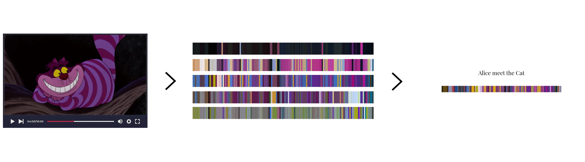
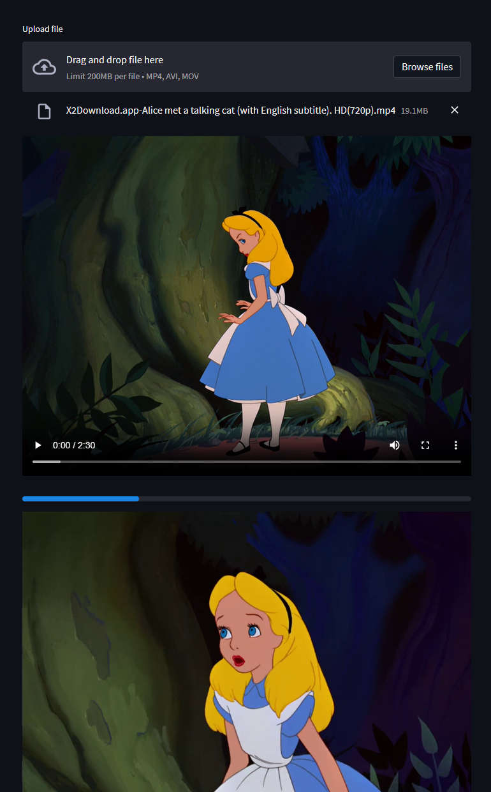

# Video Colors Barcode



## Description
This is a simple python script that generates a barcode from a video file. The barcode is generated by taking the average color of each frame and then plotting it on a canvas.

## Installation
Download or clone the repository.
```bash
git clone https://github.com/lanzani/VideoColorsBarcode
```

Install the dependencies with poetry.
```bash
poetry install
```

Or use pip.
```bash
pip install -r requirements.txt
```

## Script

## Streamlit UI

To run the streamlit UI, run the following command.
```bash
streamlit run VideoColorsBarcode/app.py
```





